# :wave: Hi there!

I am **_Sean Linguine_**, Technology Leader & AWS Cloud Native Architect because :microphone: YAML'ing ain't easy! :notes:

## :bowtie: They call me Sean The Automator

Even the animation at the top is created from code. Source is: [here.](scripts/linguine.sh)

  * :fork_and_knife: Fork my GitHub profile here: 
  * :coffee: If you like it then: [please buy me a coffee](https://www.buymeacoffee.com/linguinecode)
  * :nerd_face: Visit my website to see more: https://linguineco.de

## :blush: Most of my projects proudly display these badges

## :heart_eyes: I :heart: Serverless

## :relaxed: I'm deploying to production with

## :open_mouth: I'm managing infrastructure with

